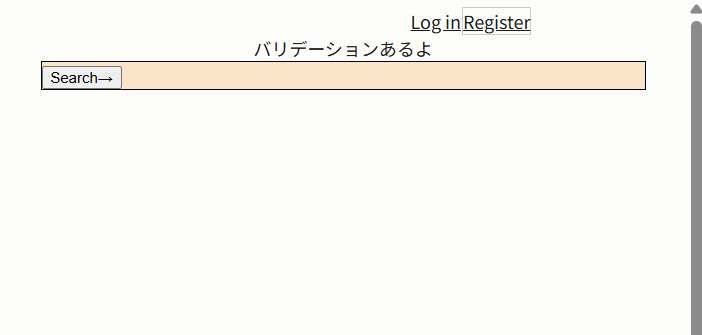
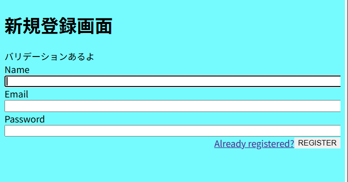
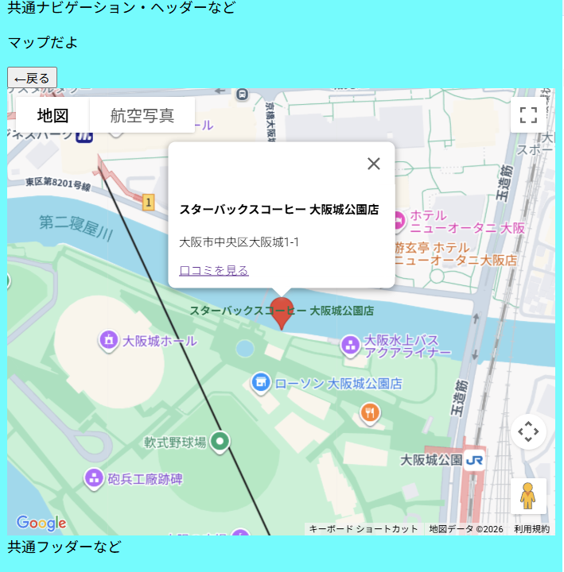
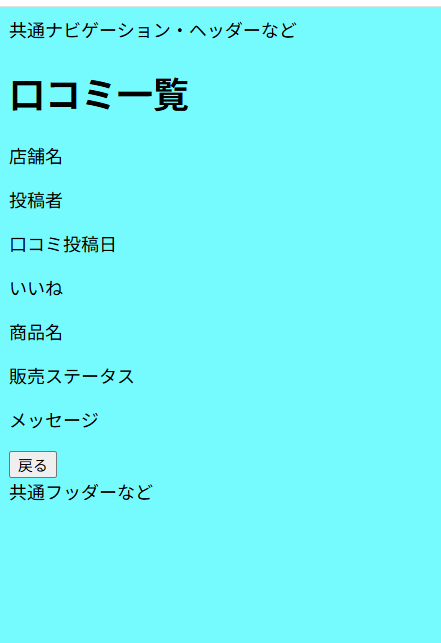
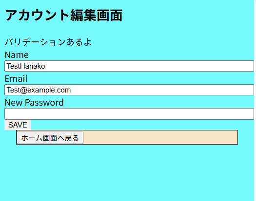

# TeamProject2（プロジェクト名は後で確定）

## 概要

-   目的：<一言で>
-   対象ユーザー：<誰が使うか>
-   成果物：<Web/CLI/モバイル 等>

## 動作環境

-   Docker / Docker Compose v2
-   言語・FW：<Ruby 3.1 / Rails 7 など>
-   DB：<MySQL 8 など>

## セットアップ（開発者向け）

```bash
# 初回のみ
docker compose up -d --build
docker compose exec web bin/rails db:create db:migrate
exit
```

## php で始まるコマンドを打ちたいとき

※コンテナの中に入る

```
docker compose exec laravel.test bash
```

## @Vite 使用　 Blade(HTML)表示
```
docker-compose exec laravel.test npm run dev
```

Docker 立ち上げ後、`npm run dev`は必須

| 初期画面                      |     |
| ----------------------------- | --- |
| http://127.0.0.1/             |     |
|  |     |

| 新規登録                        | ログイン                        |
| ------------------------------- | ------------------------------- |
| http://127.0.0.1/register       | http://127.0.0.1/login          |
|  |  |

■ ゲスト
| search| 口コミを見る|
| ---------------------- | --- |
| [http://127.0.0.1/map ](http://127.0.0.1/map) |http://127.0.0.1/reviews |
|  ||

■ ログインユーザー
| ホーム画面 | アカウント編集画面|
| ---------------------- | --- |
| [http://127.0.0.1/example ](http://127.0.0.1/example) | http://127.0.0.1/profile|
| | |

| 口コミ一覧画面                  |     |
| ------------------------------- | --- |
| http://127.0.0.1/author-reviews |     |
|  |     |

```
ユーザー名：TestHanako
メールアドレス：Test@example.com
パスワード：Testtest1234
```
